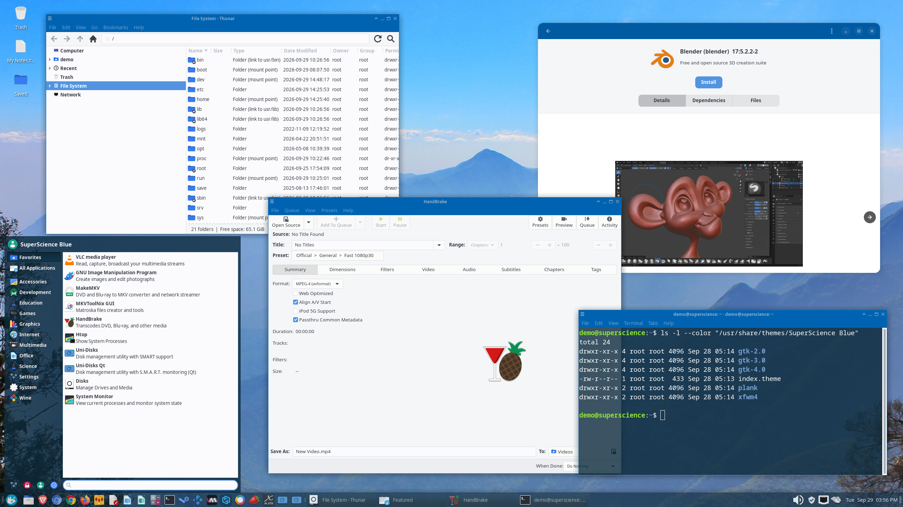
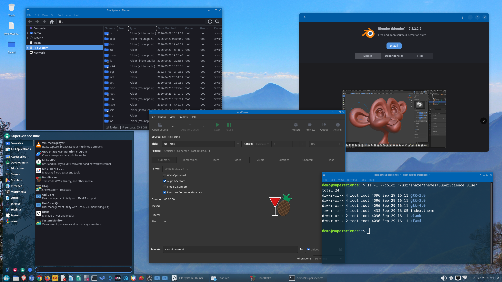

<!-- README.md (SuperScience Blue) -->
<!-- Created: 2026-09-28 04:50 | Last change: 2026-09-29 19:56 — only the light and dark desktop screenshots, captioned. -->

# SuperScience Blue

A clean, light blue desktop theme for Linux, covering GTK2, GTK3, GTK4
(including libadwaita apps) and the Xfwm4 window manager, with a dark variant,
SuperScience Blue-Dark. Developed and used daily on Xfce.

**Light — SuperScience Blue**



**Dark — SuperScience Blue-Dark**



## What's included

| Part | Folder | Notes |
|---|---|---|
| GTK2 | `theme/gtk-2.0` | Needs the murrine engine (see below) |
| GTK3 | `theme/gtk-3.0` | |
| GTK4 | `theme/gtk-4.0` | Built from the GTK3 theme by `tools/build.sh` |
| libadwaita | `theme/gtk-4.0/libadwaita.css` | Applied at login, see below |
| Xfwm4 | `theme/xfwm4` | Window borders and buttons |
| Plank | `theme/plank` | Dock theme |
| Dark variant | `theme-dark` | SuperScience Blue-Dark: GTK3 and GTK4; shares the Xfwm4 and Plank themes |

## Get the full look

The screenshots above also use these settings, which are not part of the
theme itself:

- **Icons:** Flat-Remix-Blue-Light-darkPanel (Arch: `flat-remix`).
- **Fonts:** Sans 10, Monospace 10; window titles Sans Bold 9, centered.
- **Panel:** at the bottom, 40 px, full width, 80% opacity; its background
  comes from the theme.
- **Whisker menu:** 80% opacity, with categories, commands and search at
  their alternate positions (Properties → Appearance).
- **Terminal (xfce4-terminal):** transparent background at 0.80 darkness,
  background `#0d2b3d`, text `#ffffff`, Tango palette, Monospace 14.
- **Window manager (Xfwm4):** compositing on, window shadows at 50%, windows
  80% opaque while moving or resizing.
- **Wallpaper:** cropped from "Blue Kodaikanal" (see Credits).

## Dark mode

The package installs two themes: **SuperScience Blue** and
**SuperScience Blue-Dark**. Choose either in your desktop's appearance
settings (Xfce: Settings → Appearance). The window borders stay the same blue
in both.

In the dark theme, window contents are dark with light text; the blue title
bars, menu bars, panel and Whisker menu keep the light theme's colors. On
Xfce 4.20, choosing SuperScience Blue-Dark in Appearance also switches
libadwaita apps (such as Pamac) to dark; the "-Dark" at the end of the name is
what tells Xfce it is a dark theme.

A few apps that draw parts of their windows themselves (for example the CPU
graph in Virtual Machine Manager) keep the old colors until they are reopened.

## Install

### Arch Linux

Install the AUR package
[superscience-blue-gtk-theme](https://aur.archlinux.org/packages/superscience-blue-gtk-theme)
with an AUR helper, for example:

```
paru -S superscience-blue-gtk-theme
```

or without a helper:

```
git clone https://aur.archlinux.org/superscience-blue-gtk-theme.git
cd superscience-blue-gtk-theme
makepkg -si
```

It installs both themes, SuperScience Blue and SuperScience Blue-Dark.

### Other distributions

Copy the contents of `theme/` to `/usr/share/themes/SuperScience Blue/`
(for all users) or `~/.local/share/themes/SuperScience Blue/` (for yourself),
then choose "SuperScience Blue" in your desktop's appearance settings
(Xfce: Settings → Appearance and Settings → Window Manager).

For the dark theme, copy the contents of `theme-dark/` to
`SuperScience Blue-Dark/` next to it, and link its window borders and dock
theme to the light theme's:

```
cd "/usr/share/themes/SuperScience Blue-Dark"
ln -s "../SuperScience Blue/xfwm4" xfwm4
ln -s "../SuperScience Blue/plank" plank
```

For GTK2 apps, install the murrine engine (Arch: `gtk-engine-murrine` from
the AUR) and the Adwaita GTK2 engine (Arch: `gnome-themes-extra`).

## libadwaita apps (GNOME-style apps such as Pamac)

libadwaita apps ignore GTK themes. The only file they read is each user's
`~/.config/gtk-4.0/gtk.css` (GTK fixes that name). A package can't write into
home folders, so the package installs a small login entry
(`/etc/xdg/autostart/superscience-blue-libadwaita.desktop`) that does it for
each user, automatically:

- If SuperScience Blue is your selected theme, it links
  `~/.config/gtk-4.0/gtk.css` to the theme's `libadwaita.css` at login.
- If you switch to another theme, it removes that link at your next login.
- If you already have your own `gtk.css`, it never touches it.

So with the package, just choose SuperScience Blue (or SuperScience Blue-Dark)
and log out and back in. Switching to SuperScience Blue from another theme
reaches libadwaita apps at the next login; switching between SuperScience Blue
and SuperScience Blue-Dark needs no login, only reopening the apps.

The same thing can be done by hand at any time:

```
superscience-blue-libadwaita enable     # use SuperScience Blue colors
superscience-blue-libadwaita disable    # back to the default look
superscience-blue-libadwaita status
```

If you installed without the package, make the link yourself:

```
mkdir -p ~/.config/gtk-4.0
ln -s "/usr/share/themes/SuperScience Blue/gtk-4.0/libadwaita.css" ~/.config/gtk-4.0/gtk.css
```

## Modifying and building on this theme

You're welcome to. Everything needed is in this repository:

- `theme/` — the theme exactly as installed.
- `theme-dark/` — SuperScience Blue-Dark exactly as installed (its Xfwm4 and
  Plank themes are links to the light theme's, made by the package).
- `tools/` — the tools that generate the GTK4 theme and the dark theme:
  - `build.sh` — rebuilds `theme/gtk-4.0/gtk.css` from `theme/gtk-3.0/gtk.css`
    plus `tools/supplement.css`, and all of `theme-dark/` except its
    `index.theme`, then checks the GTK4 stylesheets with GTK4's own CSS
    parser. Run it after changing the GTK3 stylesheet. Needs `python3`,
    `python-gobject`, `python-pillow` and `gtk4`.
  - `convert.py` / `cssparse.py` — the GTK3 → GTK4 conversion.
  - `supplement.css` — GTK4-only widgets and color names.
  - `csscheck.py` — parses a stylesheet with GTK4 and reports errors.
  - `darken.py` — derives the dark stylesheets: greys become dark, blues and
    status colors stay, and areas that are already dark or blue in the light
    theme keep their colors.
  - `darken_images.py` — applies the same rule to the checkbox, radio,
    switch and border images.
- `theme/gtk-4.0/libadwaita.css` is written by hand.

To try a change without installing, run an app with
`GTK_THEME="SuperScience Blue" <app>` after copying `theme/` to
`~/.local/share/themes/SuperScience Blue/` (for the dark theme:
`GTK_THEME="SuperScience Blue-Dark"` and `theme-dark/`).

## Credits

SuperScience Blue is by Robert Muncrief (LightYear Designs), developed and
refined over many years. It started from other free themes, and parts of them remain:

- **Arc** by horst3180 (GPL-3.0) — the original basis of the GTK2 and GTK3
  themes, including many of their images.
  <https://github.com/horst3180/arc-theme>
- **Bluebird** Xfwm4 theme by Simon Steinbeiß and Pasi Lallinaho
  (Shimmer Project), itself based on **Axiom** by Rogier Koppejan — the
  original basis of the Xfwm4 theme.

The GTK4 and libadwaita versions were ported from the GTK3 theme in 2026, and
the dark variant was added the same year. The GTK4 port, the dark variant and
the packaging were developed with AI assistance (Claude).

The wallpaper in the desktop screenshots is cropped from
["Blue Kodaikanal"](https://commons.wikimedia.org/wiki/File:Blue_Kodaikanal.jpg)
by Silvershocky, licensed
[CC BY-SA 4.0](https://creativecommons.org/licenses/by-sa/4.0/). It is not
included in the theme.

## License

GPL-3.0-or-later. See [LICENSE](LICENSE). You may use, share and modify this
theme, including building your own theme on it, as long as your version is
shared under the same license.
