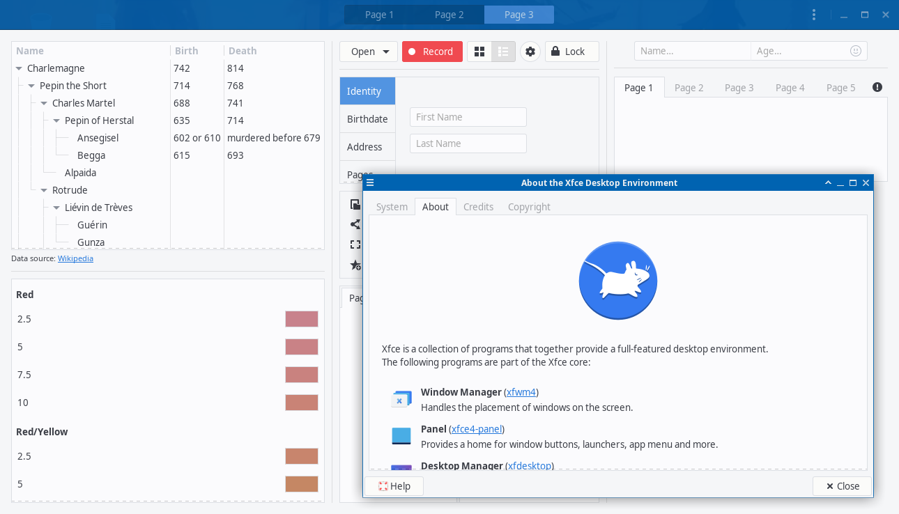
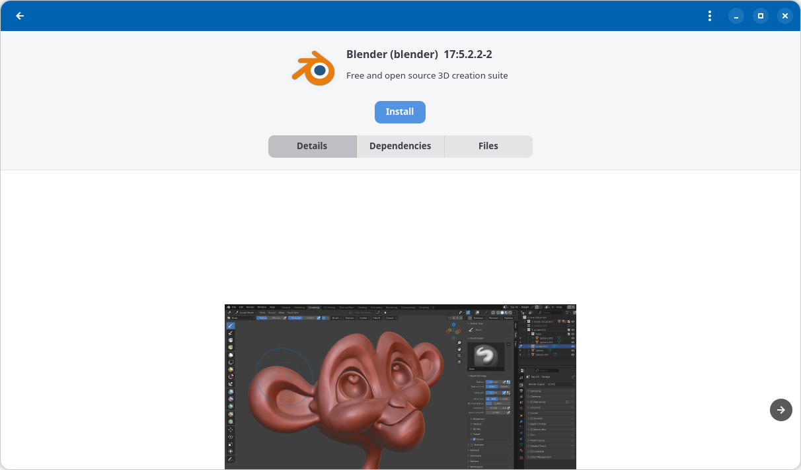

<!-- README.md (SuperScience Blue) -->
<!-- Created: 2026-09-28 04:50 | Last change: 2026-09-28 05:45 — screenshots added. -->

# SuperScience Blue

A clean, light blue desktop theme for Linux, covering GTK2, GTK3, GTK4
(including libadwaita apps) and the Xfwm4 window manager. Developed and used
daily on Xfce.





## What's included

| Part | Folder | Notes |
|---|---|---|
| GTK2 | `theme/gtk-2.0` | Needs the murrine engine (see below) |
| GTK3 | `theme/gtk-3.0` | |
| GTK4 | `theme/gtk-4.0` | Built from the GTK3 theme by `tools/build.sh` |
| libadwaita | `theme/gtk-4.0/libadwaita.css` | Applied at login, see below |
| Xfwm4 | `theme/xfwm4` | Window borders and buttons |
| Plank | `theme/plank` | Dock theme |

## Install

### Arch Linux (AUR)

```
yay -S superscience-blue-gtk-theme
```

(or any other AUR helper, or `git clone` the AUR package and run `makepkg -si`).

### Other distributions

Copy the contents of `theme/` to `/usr/share/themes/SuperScience Blue/`
(for all users) or `~/.local/share/themes/SuperScience Blue/` (for yourself),
then choose "SuperScience Blue" in your desktop's appearance settings
(Xfce: Settings → Appearance and Settings → Window Manager).

For GTK2 apps, install the murrine engine (Arch: `gtk-engine-murrine` from
the AUR) and the Adwaita GTK2 engine (Arch: `gnome-themes-extra`).

## libadwaita apps (GNOME-style apps such as Pamac)

libadwaita apps ignore GTK themes. The only file they read is each user's
`~/.config/gtk-4.0/gtk.css` (GTK fixes that name). A package can't write into
home folders, so the package installs a small login entry
(`/etc/xdg/autostart/superscience-blue-libadwaita.desktop`) that does it for
each user, automatically:

- If SuperScience Blue is your selected theme, it links
  `~/.config/gtk-4.0/gtk.css` to the theme's `libadwaita.css` at login.
- If you switch to another theme, it removes that link at your next login.
- If you already have your own `gtk.css`, it never touches it.

So with the package, just choose SuperScience Blue and log out and back in.
A theme change reaches libadwaita apps at the next login.

The same thing can be done by hand at any time:

```
superscience-blue-libadwaita enable     # use SuperScience Blue colors
superscience-blue-libadwaita disable    # back to the default look
superscience-blue-libadwaita status
```

If you installed without the package, make the link yourself:

```
mkdir -p ~/.config/gtk-4.0
ln -s "/usr/share/themes/SuperScience Blue/gtk-4.0/libadwaita.css" ~/.config/gtk-4.0/gtk.css
```

## Modifying and building on this theme

You're welcome to. Everything needed is in this repository:

- `theme/` — the theme exactly as installed.
- `tools/` — the tools that generate the GTK4 theme from the GTK3 one:
  - `build.sh` — rebuilds `theme/gtk-4.0/gtk.css` from `theme/gtk-3.0/gtk.css`
    plus `tools/supplement.css`, and checks the result with GTK4's own CSS
    parser. Run it after changing the GTK3 stylesheet. Needs `python3`,
    `python-gobject` and `gtk4`.
  - `convert.py` / `cssparse.py` — the GTK3 → GTK4 conversion.
  - `supplement.css` — GTK4-only widgets and color names.
  - `csscheck.py` — parses a stylesheet with GTK4 and reports errors.
  - `darken.py` and `proposals/gtk-dark.css` — an experimental dark variant.
    It is not installed and not yet finished.
- `theme/gtk-4.0/libadwaita.css` is written by hand.

To try a change without installing, run an app with
`GTK_THEME="SuperScience Blue" <app>` after copying `theme/` to
`~/.local/share/themes/SuperScience Blue/`.

## Credits

SuperScience Blue is by Robert Muncrief, developed and refined over many
years. It started from other free themes, and parts of them remain:

- **Arc** by horst3180 (GPL-3.0) — the original basis of the GTK2 and GTK3
  themes, including many of their images.
  <https://github.com/horst3180/arc-theme>
- **Bluebird** Xfwm4 theme by Simon Steinbeiß and Pasi Lallinaho
  (Shimmer Project), itself based on **Axiom** by Rogier Koppejan — the
  original basis of the Xfwm4 theme.

The GTK4 and libadwaita versions were ported from the GTK3 theme in 2026.

## License

GPL-3.0-or-later. See [LICENSE](LICENSE). You may use, share and modify this
theme, including building your own theme on it, as long as your version is
shared under the same license.
